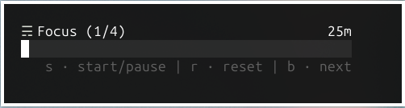

# tPomodoro
simple Pomodoro (TUI)



### Features
- [ x ] simple pomodoro in terminal
- [ x ] minimal by design
- [ - ] customization through cli

## Installation
#### Pre-built
- just grab it from [release](https://github.com/CSaratakij/tPomodoro/releases), unzip and have fun :D

#### Build from source
```shell
# Clone the tPomodoro repository
$ git clone "https://github.com/CSaratakij/tPomodoro.git"
$ cd tPomodoro

# Fetch dependencies and build
$ go mod download
$ go build main.go
```

## Getting Started
### Keybinding
|Key|Action|
|---|------|
|s, spacebar|start / pause|
|r, reset|reset current state|
|ctrl+r|reset state to focus|
|b|next state|
|tab|toggle hint style|

### For alert when timer finish
no built-in alert, use [external scripts](tPomodoro-alert.sh) instead.<br>
include with default [beep sound](res/beep_success.wav).<br>
set environment variables appropriately.<br>

|Variable|Description|Default|
|--------|-----------|-------|
|tPOMODORO_ALERT_AUDIO_PATH|absolute path of .wav audio file to play during alert|""|
|tPOMODORO_ALERT_SCRIPT|absoulte path to alert shell scripts|""|
|tPOMODORO_ALERT_TIMEOUT|alert timeout in miliseconds|30000|

example:<br>
```shell
$ export tPOMODORO_ALERT_TIMEOUT=0      # disable timeout
```

## Author
[@CSaratakij](https://github.com/csaratakij)
